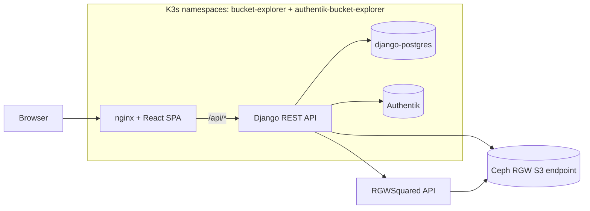
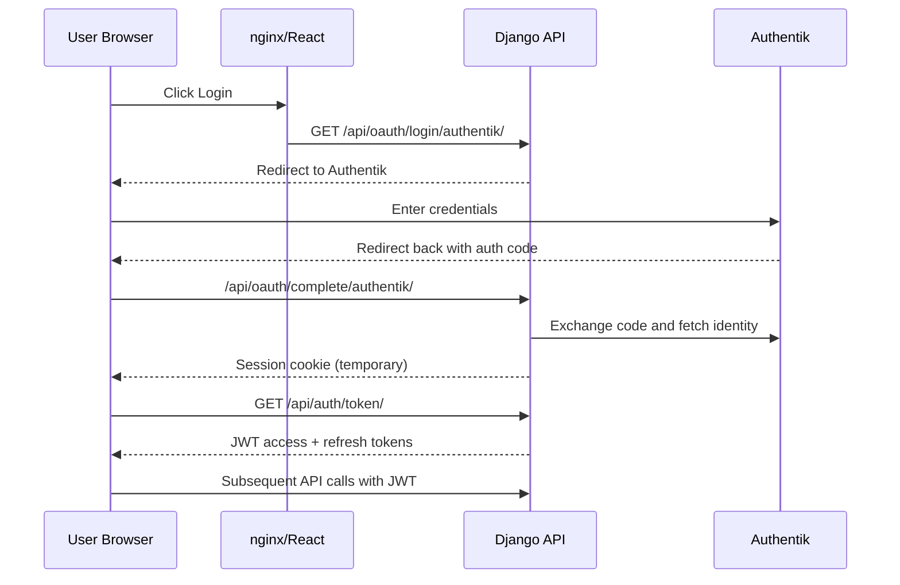

# Bucket Explorer

A web application for managing S3 buckets on **Ceph RADOS Gateway (RGW)**, deployed on **Kubernetes (K3s)**. Built with Django REST Framework, React, nginx, PostgreSQL, Authentik OAuth2/OIDC, and the RGWSquared integration used by the storage platform.

**Live deployment:** [https://buckets-explorer.areasciencepark.it/](https://buckets-explorer.areasciencepark.it/)

## Architecture



Read this left-to-right:

1. Browser traffic reaches nginx, which serves the React SPA.
2. nginx proxies `/api/*` calls to Django on the same origin.
3. Django stores app metadata in PostgreSQL and delegates identity to Authentik.
4. Django synchronizes tenant data with RGWSquared and performs S3 operations against Ceph RGW.

### How the pieces connect

| Layer                     | What                                                           | Why                                                    |
| ------------------------- | -------------------------------------------------------------- | ------------------------------------------------------ |
| **React SPA**       | User interface served by nginx                                 | The user's browser runs JavaScript that calls the API  |
| **nginx**           | Reverse proxy: serves React + proxies `/api/*` to Django     | Same-origin pattern (BFF) — cookies work without CORS |
| **Django REST API** | Business logic, auth, RGWSquared sync, S3 operations via boto3 | Validates requests and keeps app state consistent      |
| **PostgreSQL**      | User metadata, bucket ownership records                        | Keeps track of who owns what                           |
| **Authentik**       | OAuth2/OIDC identity provider                                  | Handles login: "who are you?"                          |
| **Ceph RGW**        | S3-compatible object storage (external to cluster)             | Where files actually live, replicated across OSDs      |

### Authentication flow



Key idea: login is browser redirect-based (OAuth2), while normal app usage is token-based (JWT).

### Tenant and storage model

The app separates application metadata from object data:

- **Tenants** represent research areas or structures. Each active request carries one tenant context through the `X-Tenant-ID` header.
- **Project buckets** come from RGWSquared and mirror upstream proposal permissions. Users can access them according to RGWSquared RO/RW grants.
- **Local research buckets** are requested through RGWSquared for tenant members with write access. Django records ownership and sharing metadata, while Ceph RGW stores the objects.
- **S3 credentials** are not stored by the webapp. Django asks RGWSquared for transient area-management keys when it needs to operate on files inside a bucket.

This keeps the UI, permissions, and audit trail in Django while leaving durable file storage to Ceph.

### RGWSquared Dependency

This project depends on **RGWSquared**, an internal microservice developed at [AREA Science Park](https://www.areasciencepark.it/en/research-infrastructures/) for storage policy management in the ORFEO data center. RGWSquared manages user and bucket access policies for Ceph RGW storage services.

RGWSquared is essentially a service wrapper around **Ceph RGW**: RADOS Gateway, the Ceph component that exposes object storage through S3-compatible and Swift-compatible APIs. Ceph stores the objects; RGWSquared handles the higher-level policy layer that maps users, collaborations, proposals, and bucket permissions onto RGW-managed storage.

RGWSquared is currently private because it is tightly coupled to ORFEO-specific infrastructure and collaboration workflows. The integration in this repository should therefore be treated as a deployment dependency and boundary, not as a complete public specification of the microservice. A future deployment could replace RGWSquared by implementing the same essential pipeline: map collaboration/project state to users, buckets, and Ceph RGW access policies.

### Kubernetes manifests structure

`k8s/manifests/` is split into `app/` and `infra/` to mirror the deployment topology at AREA Science Park, where Authentik and other infrastructure services are administered by a separate infrastructure team — not by the team that operates Bucket Explorer. The development environment preserves this boundary explicitly: `infra.sh` owns Authentik, `app.sh` owns the webapp namespace. In production, when an Authentik instance is already running (the common case at institutions that share an identity platform), only the `app/` manifests need to be applied. See the [Production deployment guide](docs/production-deployment.md) for the full deployment workflow.

## Further Documentation

See [docs/README.md](docs/README.md) for the full index. Highlights:

- **Get started:** [Development environment setup](docs/dev-environment-setup.md), [overview](docs/dev-environment-overview.md)
- **Maintain:** [Maintainer guide](docs/bucket-explorer-maintainer-guide.md), [Testing and CI](docs/testing-and-ci.md), [RGWSquared API](docs/rgwsquared-api.md)
- **Deploy:** [Production deployment and operations](docs/production-deployment.md), [API docs](docs/api-documentation.md)
- **Reference:** [Database schema](docs/database-schema.html), [UO code tenants](docs/uo-code-tenants.md)

## Infrastructure Context

This project was developed and validated in the **[Stencil](https://gitlab.com/area7/datacenter/codes/stencil/docs/-/tree/main/docs) virtual datacenter**: a virtualized multi-node environment developed by AREA Science Park to approximate production infrastructure on a single physical machine. Stencil runs real datacenter software inside KVM virtual machines — a K3s Kubernetes cluster, a Ceph distributed storage cluster with S3-compatible RGW, FreeIPA for DNS and identity, and supporting networking services. Credit for the Stencil infrastructure goes to the AREA Science Park team.

## Quick Start

> [!NOTE]
> **First time?** Follow the [Development Environment Setup Guide](docs/dev-environment-setup.md) to provision K3s, Ceph RGW, and Authentik. The Quick Start below assumes that foundation exists. For production, use the [Production deployment guide](docs/production-deployment.md).

### Prerequisites

On the deployment host:

- `podman` for building container images
- `kubectl` with kubeconfig for the K3s cluster
- SSH access to the K3s nodes or to the host that can tunnel to them
- Node.js and npm (for building the React frontend)
- Access to a container registry reachable by both the deployment host and K3s nodes
- Access to a Ceph RGW endpoint and RGWSquared service credentials

### Frontend Dependencies

Install frontend dependencies and build the production bundle from the repository root:

```bash
cd frontend
npm ci
npm run build
```

This creates `frontend/node_modules/` and `frontend/dist/`. The deployment script performs the same bootstrap automatically when those generated directories are missing:

```bash
cd k8s
./app.sh deploy --rebuild
```

### Deploy

```bash
# 1. Set the kubeconfig (needed for all kubectl commands)
export KUBECONFIG=/tmp/k3s-tunnel-kubeconfig.yaml

# 2. Run the deployment from the repository checkout
cd k8s
./infra.sh deploy
./app.sh deploy --rebuild
```

> **Trouble?** Run `./infra.sh check` to diagnose infrastructure prerequisites such as node reachability, Kubernetes API access, registry access, and Ceph RGW health.

### Access the App

**Step 1 — Port-forward from the deployment host** (two terminals):

```bash
export KUBECONFIG=/tmp/k3s-tunnel-kubeconfig.yaml

# Terminal 1: React frontend
kubectl port-forward -n bucket-explorer svc/frontend-service 3000:80

# Terminal 2: Authentik (for OAuth2 login)
kubectl port-forward -n authentik-bucket-explorer svc/authentik-service 9000:9000
```

**Step 2 — From your laptop, tunnel to the deployment host** (development host alias: `orfeo-vm`):

```bash
ssh -L 3000:localhost:3000 -L 9000:localhost:9000 orfeo-vm
```

Or run `./app.sh access` on the deployment host—it prints the same SSH command and starts port-forwards automatically.

**Step 3 — Open browser:**

| URL                       | What            |
| ------------------------- | --------------- |
| `http://localhost:3000` | The app |
| Authentik admin local URL | Authentik admin |

**Authentik admin credential:** stored in the Authentik Kubernetes Secret configured by the selected environment overlay.

### Cleanup

```bash
export KUBECONFIG=/tmp/k3s-tunnel-kubeconfig.yaml
cd k8s
./app.sh cleanup
./infra.sh cleanup
```

---

## Development Workflow

### Script Reference

| Script | Purpose | When to use |
| --- | --- | --- |
| `infra.sh deploy` | Deploy Authentik infrastructure | First deploy; after `infra.sh cleanup` |
| `app.sh deploy --rebuild` | Build, push, and deploy the webapp | First deploy; after manifest changes |
| `app.sh backend` / `app.sh frontend` | Fast component rebuild loop | Code-only changes — no manifest re-apply |
| `infra.sh check` | Full infrastructure health check | Before deploy; when anything seems broken |
| `app.sh cleanup` / `infra.sh cleanup` | Tear down app/infra namespaces | Starting fresh or resetting the environment |
| `ci.sh install` | Install GitHub Actions ARC runner in K3s | Once per cluster; enables the CI/CD pipeline |

### The Development Loop

**Most common scenario: you changed some code and want to test it.**

```bash
cd k8s

# Changed backend code (Python)?
./app.sh backend

# Changed frontend code (React)?
./app.sh frontend

# Changed both?
./app.sh all

# Changed a K8s manifest (YAML)? Apply it directly:
export KUBECONFIG=/tmp/k3s-tunnel-kubeconfig.yaml
kubectl apply -f manifests/app/02-backend.yaml
./app.sh restart backend
```

### Start of Day / After Reboot

```bash
cd k8s

# Quick health check — is everything alive?
./app.sh status

# If SSH tunnel or port-forwards are down:
./app.sh access

# If deeper issues (Ceph, VMs, disk space):
./infra.sh check
```

**From your LOCAL machine** (laptop):

```bash
# Re-establish SSH local forwards when the deployment host is remote
ssh -L 3000:127.0.0.1:3000 -L <auth-local-port>:127.0.0.1:<auth-service-port> <deployment-host>
```

Then open `http://localhost:3000`.

### Common Scenarios

| Scenario                     | Command                                                           |
| ---------------------------- | ----------------------------------------------------------------- |
| Changed Python code          | `./app.sh backend`                                              |
| Changed React code           | `./app.sh frontend`                                             |
| Changed both                 | `./app.sh all`                                                  |
| Changed K8s manifest         | `kubectl apply -f <file>` then `./app.sh restart <component>` |
| Config change only (no code) | `./app.sh restart backend`                                      |
| Check if everything is alive | `./app.sh status`                                               |
| Port-forwards died           | `./app.sh access`                                               |
| Rebooted workstation         | Recreate your SSH local forwards to the deployment host           |
| Rebooted VM                  | `./app.sh access` then test                                     |
| Ceph seems broken            | `./infra.sh check`                                                |
| Tail backend logs            | `./app.sh logs backend`                                         |
| Start completely fresh       | `./app.sh cleanup`, `./infra.sh cleanup`, then redeploy |

## Project Structure

```
s3bucket_manager_app/
├── backend/                        # Django REST API
│   ├── Containerfile               # Container image definition
│   ├── settings.py                 # S3_*, OAuth2, JWT configuration
│   ├── urls.py                     # API route definitions
│   ├── pyproject.toml              # Python dependencies (PEP 621)
│   └── storage/                    # Main Django app
│       ├── models.py               # User (federation-ready) + Bucket models
│       ├── views/                  # Auth, bucket, and admin API endpoints
│       ├── services/               # RGWSquared, S3, sync, permissions, crypto
│       ├── serializers.py          # DRF serializers
│       └── pipeline.py             # OAuth2 pipeline (custom claims)
│
├── frontend/                       # React SPA
│   ├── Containerfile               # nginx + built React
│   ├── nginx.conf                  # Reverse proxy config (BFF pattern)
│   ├── package.json
│   └── src/                        # React components
│
├── k8s/                            # Kubernetes deployment + tooling
│   ├── manifests/
│   │   ├── infra/                  # Authentik namespace resources
│   │   └── app/                    # Webapp namespace resources
│   ├── env/                        # dev config + secret templates
│   ├── configure_authentik.py      # Auto-configure OAuth2 provider
│   ├── infra.sh                    # Authentik infra operator script
│   └── app.sh                      # Webapp deploy + dev loop
│
├── .gitignore
├── LICENSE                         # EUPL-1.2-or-later license text
├── NOTICE                          # Attribution and project context
└── README.md                       # This file
```

> **Container images:** During development, images are built and pushed to `ghcr.io/luisfpal/buckets-explorer-{backend,frontend}` for full control and rapid iteration. `k8s/.env` (gitignored) holds the `GHCR_TOKEN` used by `app.sh`. Future maintainers must update `GHCR_OWNER` in `k8s/app.sh`, create their own `k8s/.env`, and point manifest `image:` fields at their registry. Coverage uploads use the same maintainer GitHub account on Codecov until a new project is linked. See the [Production deployment guide](docs/production-deployment.md) and [Testing and CI](docs/testing-and-ci.md).

## Operations Notes

The public repository documents the portable deployment shape. Environment-specific hostnames, IP addresses, tunnel sockets, dashboard credentials, and break-glass Ceph procedures belong in the operator runbook for the target infrastructure.

For a normal development deployment, start with the app/infra scripts:

```bash
cd k8s
./infra.sh check
./infra.sh deploy
./app.sh deploy --rebuild
./app.sh access
```

`infra.sh` owns Authentik infrastructure. `app.sh` owns the webapp namespace and image rebuild loop.

### Switching S3 Endpoint

The S3 endpoint is runtime configuration. Update the ConfigMap value and restart the backend; no image rebuild is required. S3 access keys come from RGWSquared `structureInfo`, not Kubernetes secrets.

```bash
export KUBECONFIG=/path/to/kubeconfig

kubectl patch configmap backend-config -n bucket-explorer --type merge \
  -p '{"data":{"S3_ENDPOINT":"https://<s3-rgw-endpoint>","S3_VERIFY_SSL":"True"}}' && \
kubectl rollout restart deployment/backend -n bucket-explorer
```

> **Note:** `k8s/manifests/app/02-backend.yaml` references environment overlay resources. A full `./app.sh deploy` reapplies overlay defaults. Set `S3_VERIFY_SSL=False` in the dev overlay if Ceph RGW uses a self-signed certificate.

### General Troubleshooting

| Symptom                                 | Likely cause                                                         | First check                                                                        |
| --------------------------------------- | -------------------------------------------------------------------- | ---------------------------------------------------------------------------------- |
| `kubectl` hangs or connection refused | Kubeconfig, tunnel, or API reachability issue                        | `./infra.sh check`                                                                 |
| Backend CrashLoopBackOff                | PostgreSQL, Authentik, or required secret missing                    | `kubectl logs <pod> -n bucket-explorer --all-containers`                          |
| Login redirects fail                    | Authentik provider/client not configured for the active callback URL | Re-run `./infra.sh configure` and inspect `configure_authentik.py` logs |
| S3 `AccessDenied`                     | RGWSquared returned stale/invalid transient keys or bucket policy is stale | Run the admin sync flow and check RGWSquared `structureInfo`                |
| S3 connection errors                    | Ceph RGW endpoint, TLS, or network failure                           | Check `S3_ENDPOINT`, `S3_VERIFY_SSL`, and Ceph RGW health                      |
| Frontend cannot call the API            | nginx cannot resolve or reach `backend-service`                    | Inspect frontend pod logs and `frontend/nginx.conf`                              |

For the complete virtual datacenter topology and hardware requirements, see the [Development Environment Overview](docs/dev-environment-overview.md).

## Credentials

Use Kubernetes Secrets only. No literal credentials should be documented in this repository.

| Service                    | Secret Source                 |
| -------------------------- | ----------------------------- |
| Authentik admin bootstrap  | Authentik Kubernetes Secret   |
| OIDC client credential     | Backend Kubernetes Secret     |
| RGWSquared credentials     | Backend Kubernetes Secret     |
| Django database credential | Backend Kubernetes Secret     |

Set real values in `k8s/env/dev/*.local.yaml` (gitignored) or your external secret manager.

## Reproducibility

The repository stores source code, Kubernetes templates, dependency manifests, and lockfiles. Frontend generated artifacts are reproducible from `frontend/package-lock.json` with `npm ci` and `npm run build`; `k8s/app.sh` runs those commands automatically when it needs the generated directories for deployment.

Backend dependencies are pinned in `backend/pyproject.toml` and installed by `backend/Containerfile`. Frontend dependencies are locked in `frontend/package-lock.json`.

## Acknowledgements

This project is part of a master's thesis submitted for the **Master in Data Management and Curation (MDMC)** programme at SISSA and AREA Science Park (2025–2026). The thesis title is *Building Service Layers in the NFFA-DI Digital Ecosystem: Governed Bucket Management and Reusable Analysis Services*.

I would like to thank my supervisor, **Dr. Federica Bazzocchi** ([federica.bazzocchi@areasciencepark.it](mailto:federica.bazzocchi@areasciencepark.it)), for her guidance and support throughout this thesis work.

## License

Copyright is held by AREA Science Park. The author is Luis Fernando Palacios Flores.

Licensed under the European Union Public Licence, version 1.2 or later (`EUPL-1.2-or-later`). See `LICENSE` and `NOTICE`.
