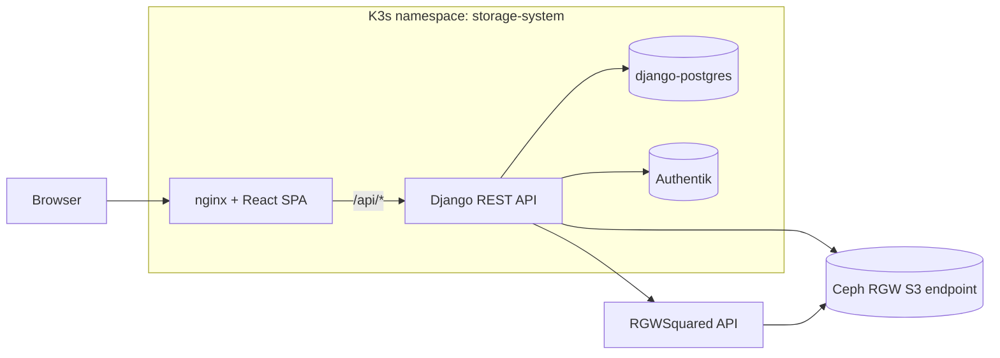
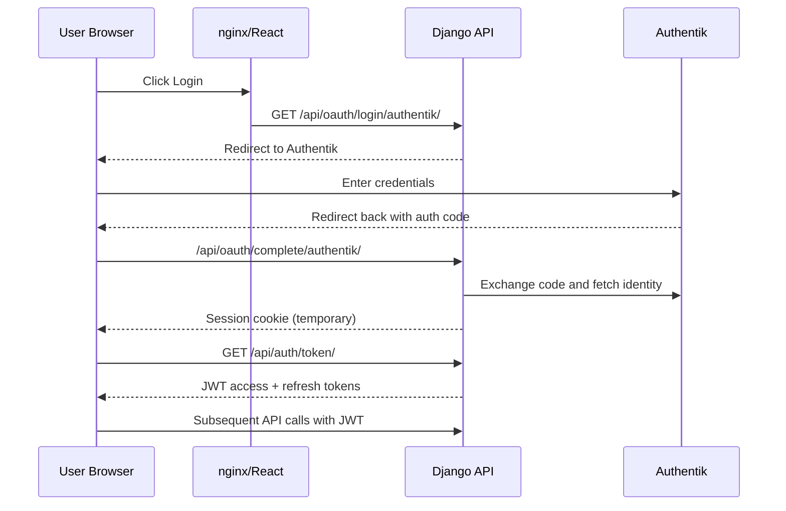

# S3 Bucket Manager

A web application for managing S3 buckets on **Ceph RADOS Gateway (RGW)**, deployed on **Kubernetes (K3s)**. Built with Django REST Framework, React, nginx, PostgreSQL, Authentik OAuth2/OIDC, and the RGWSquared integration used by the storage platform.

## Architecture



Read this left-to-right:

1. Browser traffic reaches nginx, which serves the React SPA.
2. nginx proxies `/api/*` calls to Django on the same origin.
3. Django stores app metadata in PostgreSQL and delegates identity to Authentik.
4. Django synchronizes tenant data with RGWSquared and performs S3 operations against Ceph RGW.

### How the pieces connect

| Layer                     | What                                                           | Why                                                    |
| ------------------------- | -------------------------------------------------------------- | ------------------------------------------------------ |
| **React SPA**       | User interface served by nginx                                 | The user's browser runs JavaScript that calls the API  |
| **nginx**           | Reverse proxy: serves React + proxies `/api/*` to Django     | Same-origin pattern (BFF) — cookies work without CORS |
| **Django REST API** | Business logic, auth, RGWSquared sync, S3 operations via boto3 | Validates requests and keeps app state consistent      |
| **PostgreSQL**      | User metadata, bucket ownership records                        | Keeps track of who owns what                           |
| **Authentik**       | OAuth2/OIDC identity provider                                  | Handles login: "who are you?"                          |
| **Ceph RGW**        | S3-compatible object storage (external to cluster)             | Where files actually live, replicated across OSDs      |

### Authentication flow



Key idea: login is browser redirect-based (OAuth2), while normal app usage is token-based (JWT).

### Tenant and storage model

The app separates application metadata from object data:

- **Tenants** represent research areas or structures. Each active request carries one tenant context through the `X-Tenant-ID` header.
- **Project buckets** come from RGWSquared and mirror upstream proposal permissions. Users can access them according to RGWSquared RO/RW grants.
- **Local research buckets** are created inside the app for tenant members with write access. Django records ownership and sharing metadata, while Ceph RGW stores the objects.
- **Cached S3 credentials** are stored encrypted in PostgreSQL and decrypted only when the backend needs to call Ceph RGW.

This keeps the UI, permissions, and audit trail in Django while leaving durable file storage to Ceph.

## Infrastructure Context

This project was developed and validated in a Stencil virtual datacenter: a virtualized multi-node environment used during the internship to approximate production infrastructure without requiring dedicated physical servers. Stencil runs real datacenter software inside VMs, including a K3s Kubernetes cluster, Ceph RGW for S3-compatible object storage, and supporting identity/networking services.

The application is therefore designed around production-like boundaries: containers are built and pushed to a registry, Kubernetes pulls those images onto cluster nodes, Django stores application state in PostgreSQL, and object data lives outside the app namespace in Ceph RGW. Concrete hostnames, IP addresses, credentials, and local tunnel details are environment-specific and should be supplied through `k8s/env/<env>/` templates or ignored local overrides.

## Quick Start

### Prerequisites

On the deployment host:

- `podman` for building container images
- `kubectl` with kubeconfig for the K3s cluster
- SSH access to the K3s nodes or to the host that can tunnel to them
- Node.js and npm (for building the React frontend)
- Access to a container registry reachable by both the deployment host and K3s nodes
- Access to a Ceph RGW endpoint and RGWSquared service credentials

### Frontend Dependencies

Install frontend dependencies and build the production bundle from the repository root:

```bash
cd frontend
npm ci
npm run build
```

This creates `frontend/node_modules/` and `frontend/dist/`. The deployment script performs the same bootstrap automatically when those generated directories are missing:

```bash
cd k8s
./dev.sh deploy --env dev --rebuild
```

There is no root-level JavaScript workspace for this project; all Node dependencies live under `frontend/`.

### Deploy

```bash
# 1. Set the kubeconfig (needed for all kubectl commands)
export KUBECONFIG=/tmp/k3s-tunnel-kubeconfig.yaml

# 2. Run the deployment from the repository checkout
cd k8s
./dev.sh deploy --env dev --rebuild
```

The script will:

1. Build backend and frontend container images with `podman`
2. Push images to the configured registry
3. Apply environment overlays and Kubernetes manifests in dependency order
4. Restart workloads so K3s pulls updated images
5. Wait for pods and rollouts to become healthy
6. Auto-configure the Authentik OAuth2 provider
7. Print access instructions for the selected environment

> **Trouble?** Run `./dev.sh check` to diagnose infrastructure prerequisites such as node reachability, Kubernetes API access, registry access, and Ceph RGW health.

> **Want the manual operator flow?** Read `GUIDE.md` for the architecture and troubleshooting guide.

### Access the App

**Step 1 — Port-forward from the deployment host** (two terminals):

```bash
export KUBECONFIG=/tmp/k3s-tunnel-kubeconfig.yaml

# Terminal 1: React frontend
kubectl port-forward -n storage-system svc/frontend-service 3000:80

# Terminal 2: Authentik (for OAuth2 login)
kubectl port-forward -n storage-system svc/authentik-service 9000:9000
```

**Step 2 — If the deployment host is remote, create SSH local forwards from your workstation:**

```bash
ssh -L 3000:localhost:3000 -L 9000:localhost:9000 <deployment-host>
```

**Step 3 — Open browser:**

| URL                       | What            |
| ------------------------- | --------------- |
| `http://localhost:3000` | The app         |
| `http://localhost:9000` | Authentik admin |

**Authentik admin password:** stored in Kubernetes secret `authentik-secret.bootstrap-password` (set in `k8s/env/<env>/secrets.local.yaml`).

### Cleanup

```bash
export KUBECONFIG=/tmp/k3s-tunnel-kubeconfig.yaml
cd k8s
./dev.sh cleanup
```

---

## Development Workflow

### Script Reference

| Script                    | Purpose                       | When to use                          |
| ------------------------- | ----------------------------- | ------------------------------------ |
| `dev.sh deploy --env dev --rebuild` | Full deployment with env overlays    |
| `dev.sh`                | Fast inner loop (~60s)        | Every code change during development |
| `dev.sh check`          | Infrastructure health check   | After reboots, when things break     |
| `dev.sh cleanup`        | Tear down namespace/resources | Start fresh                          |

### The Development Loop

**Most common scenario: you changed some code and want to test it.**

```bash
cd k8s

# Changed backend code (Python)?
./dev.sh backend

# Changed frontend code (React)?
./dev.sh frontend

# Changed both?
./dev.sh all

# Changed a K8s manifest (YAML)? Apply it directly:
export KUBECONFIG=/tmp/k3s-tunnel-kubeconfig.yaml
kubectl apply -f manifests/05-backend.yaml -n storage-system
./dev.sh restart backend
```

**What `./dev.sh backend` does under the hood** (manual steps for reference):

```bash
# 1. Build container image
podman build -t <registry>/s3mgr-backend:latest -f backend/Containerfile backend/

# 2. Push to the configured registry
podman push <registry>/s3mgr-backend:latest

# 3. Restart the deployment (picks up new image)
kubectl rollout restart deployment/backend -n storage-system
kubectl rollout status deployment/backend -n storage-system --timeout=120s
```

### Start of Day / After Reboot

```bash
cd k8s

# Quick health check — is everything alive?
./dev.sh status

# If SSH tunnel or port-forwards are down:
./dev.sh access

# If deeper issues (Ceph, VMs, disk space):
./dev.sh check
```

**From your LOCAL machine** (laptop):

```bash
# Re-establish SSH local forwards when the deployment host is remote
ssh -L 3000:localhost:3000 -L 9000:localhost:9000 <deployment-host>
```

Then open `http://localhost:3000`.

### Common Scenarios

| Scenario                     | Command                                                           |
| ---------------------------- | ----------------------------------------------------------------- |
| Changed Python code          | `./dev.sh backend`                                              |
| Changed React code           | `./dev.sh frontend`                                             |
| Changed both                 | `./dev.sh all`                                                  |
| Changed K8s manifest         | `kubectl apply -f <file>` then `./dev.sh restart <component>` |
| Config change only (no code) | `./dev.sh restart backend`                                      |
| Check if everything is alive | `./dev.sh status`                                               |
| Port-forwards died           | `./dev.sh access`                                               |
| Rebooted workstation         | Recreate your SSH local forwards to the deployment host           |
| Rebooted VM                  | `./dev.sh access` then test                                     |
| Ceph seems broken            | `./dev.sh check`                                                |
| Tail backend logs            | `./dev.sh logs backend`                                         |
| Start completely fresh       | `./dev.sh cleanup` then `./dev.sh deploy --env dev --rebuild` |

### Git Workflow

```
main                    Always deployable. Tagged working states.
  └── dev/<feature>     Active development. Code may break.
```

- **Never commit broken code to `main`**. Work on feature branches.
- **Commit often** on dev branches. Small diffs are easier to debug.
- When a feature works, merge to `main`.

## Project Structure

```
s3bucket_manager_app/
├── backend/                        # Django REST API
│   ├── Containerfile               # Container image definition
│   ├── settings.py                 # S3_*, OAuth2, JWT configuration
│   ├── urls.py                     # API route definitions
│   ├── requirements.txt            # Python dependencies
│   └── storage/                    # Main Django app
│       ├── models.py               # User (federation-ready) + Bucket models
│       ├── views/                  # Auth, bucket, and admin API endpoints
│       ├── services/               # RGWSquared, S3, sync, permissions, crypto
│       ├── serializers.py          # DRF serializers
│       ├── pipeline.py             # OAuth2 pipeline (custom claims)
│       └── management/commands/    # Operational Django commands
│
├── frontend/                       # React SPA
│   ├── Containerfile               # nginx + built React
│   ├── nginx.conf                  # Reverse proxy config (BFF pattern)
│   ├── package.json
│   └── src/                        # React components
│
├── k8s/                            # Kubernetes deployment + tooling
│   ├── manifests/
│   │   ├── 00-namespace.yaml
│   │   ├── 01-authentik-postgres.yaml
│   │   ├── 02-authentik-redis.yaml
│   │   ├── 03-authentik-server.yaml
│   │   ├── 04-django-postgres.yaml
│   │   ├── 05-backend.yaml
│   │   ├── 06-frontend.yaml
│   │   └── 07-cronjob.yaml
│   ├── env/                        # dev/prod config + secret templates
│   ├── configure_authentik.py      # Auto-configure OAuth2 provider
│   └── dev.sh                      # Unified deploy + dev loop
│
├── .gitignore
├── GUIDE.md                        # Architecture and operations guide
├── LICENSE                         # Intended EUPL-1.2 license text
├── NOTICE                          # Attribution and project context
└── README.md                       # This file
```

## Key Design Decisions

### Why external Ceph RGW?

The target deployment uses a **Ceph cluster** providing S3-compatible storage through RGW. Object data is intentionally outside the application namespace: Kubernetes runs the web app and databases, while Ceph owns durable object storage.

Since Ceph RGW speaks the **S3 protocol**, Django uses `boto3` through generic `S3_*` settings. Changing the backing S3-compatible endpoint is a configuration change, not a code rewrite.

### Why S3_* instead of MINIO_*?

Settings use a generic `S3_` prefix to be backend-agnostic. Tomorrow you could point this at AWS S3 or any other S3-compatible service by changing environment variables. The code doesn't need to know or care.

### Why the BFF pattern?

The Backend-for-Frontend pattern means nginx serves both the React app and proxies API calls. This keeps everything on the same origin, so session cookies (needed during OAuth2 handshake) work without CORS complexity.

### Why configurable TLS verification?

Development Ceph RGW deployments may use self-signed TLS certificates. Production should add the trusted CA certificate to the runtime image or platform trust store and set `S3_VERIFY_SSL=True`.

## Operations Notes

The public repository documents the portable deployment shape. Environment-specific hostnames, IP addresses, tunnel sockets, dashboard passwords, and break-glass Ceph procedures belong in the operator runbook for the target infrastructure.

For a normal development or staging deployment, start with the unified script:

```bash
cd k8s
./dev.sh check
./dev.sh deploy --env dev --rebuild
./dev.sh access
```

The script is the canonical operational entry point. Older helper scripts were removed so deployment, checks, access setup, and cleanup stay in one maintained workflow.

### Switching S3 Endpoint

The S3 endpoint is runtime configuration. Update the ConfigMap/Secret values and restart the backend; no image rebuild is required.

```bash
export KUBECONFIG=/path/to/kubeconfig

kubectl patch configmap backend-config -n storage-system --type merge \
  -p '{"data":{"S3_ENDPOINT":"https://<s3-rgw-endpoint>","S3_VERIFY_SSL":"True"}}' && \
kubectl patch secret backend-secret -n storage-system \
  -p '{"stringData":{"s3-access-key":"<access-key>","s3-secret-key":"<secret-key>"}}' && \
kubectl rollout restart deployment/backend -n storage-system
```

> **Note:** `k8s/manifests/05-backend.yaml` references environment overlay resources. A full `./dev.sh deploy --env <env>` reapplies overlay defaults.

### General Troubleshooting

| Symptom                                 | Likely cause                                                         | First check                                                                        |
| --------------------------------------- | -------------------------------------------------------------------- | ---------------------------------------------------------------------------------- |
| `kubectl` hangs or connection refused | Kubeconfig, tunnel, or API reachability issue                        | `./dev.sh check`                                                                 |
| Backend CrashLoopBackOff                | PostgreSQL, Authentik, or required secret missing                    | `kubectl logs <pod> -n storage-system --all-containers`                          |
| Login redirects fail                    | Authentik provider/client not configured for the active callback URL | Re-run `./dev.sh deploy --env <env>` and inspect `configure_authentik.py` logs |
| S3 `AccessDenied`                     | Wrong tenant credentials or stale RGWSquared sync data               | Check `backend-secret` and run the admin sync flow                               |
| S3 connection errors                    | Ceph RGW endpoint, TLS, or network failure                           | Check `S3_ENDPOINT`, `S3_VERIFY_SSL`, and Ceph RGW health                      |
| Frontend cannot call the API            | nginx cannot resolve or reach `backend-service`                    | Inspect frontend pod logs and `frontend/nginx.conf`                              |

### Stencil Deployment Shape

The Stencil validation environment used a virtualized multi-node topology:

| Role                  | Count               | Responsibility                            |
| --------------------- | ------------------- | ----------------------------------------- |
| K3s server nodes      | 3                   | Kubernetes API, scheduler, workloads      |
| Ceph service nodes    | 3                   | RGW, monitoring, metadata services        |
| Ceph OSD nodes        | 3                   | Durable object storage                    |
| Registry              | 1                   | Container image distribution to K3s nodes |
| Identity/DNS services | Environment-managed | OAuth2/OIDC and stable service discovery  |

## Credentials

Use Kubernetes Secrets only. No literal credentials should be documented in this repository.

| Service                   | Secret Source                                                                   |
| ------------------------- | ------------------------------------------------------------------------------- |
| Authentik admin bootstrap | `authentik-secret.bootstrap-password`                                         |
| OIDC client secret        | `backend-secret.oidc-client-secret`                                           |
| S3 access/secret keys     | `backend-secret.s3-access-key` / `backend-secret.s3-secret-key`             |
| RGWSquared credentials    | `backend-secret.rgwsquared-username` / `backend-secret.rgwsquared-password` |
| Django DB password        | `backend-secret.database-password`                                            |

Set real values in `k8s/env/<env>/secrets.local.yaml` (gitignored) or your external secret manager.

## Reproducibility And Publication

The repository stores source code, Kubernetes templates, dependency manifests, and lockfiles. Frontend generated artifacts are reproducible from `frontend/package-lock.json` with `npm ci` and `npm run build`; `k8s/dev.sh` runs those commands automatically when it needs the generated directories for deployment.

Backend dependencies are pinned in `backend/requirements.txt`; frontend dependencies are locked in `frontend/package-lock.json`. A future migration to `pyproject.toml` + `uv.lock` is compatible with this layout, but the current publication baseline keeps the existing container build path stable.

`npm run build` currently reports a large JavaScript chunk because the NeXus/H5Web viewer is bundled into the main SPA. The warning is documented for publication; a later performance pass should lazy-load the file viewer if initial page weight becomes a deployment concern.

`npm audit --omit=dev` passes for production dependencies. A full dev audit still reports the Vite/esbuild development-server advisory; do not expose the Vite dev server outside trusted development networks, and treat the required Vite major upgrade as a separate frontend tooling task.

## License

Copyright is held by AREA Science Park. The author is Luis Fernando Palacios Flores.

Intended publication license: European Union Public Licence, version 1.2 or later (`EUPL-1.2-or-later`). Confirm AREA Science Park approval before publishing the repository under this license. See `LICENSE` and `NOTICE`.
