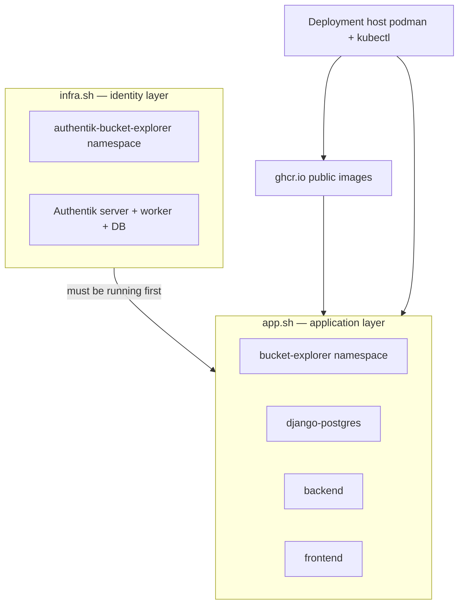

# Development Deployment Operations

Operator guide for deploying and updating Buckets Explorer on an **existing** development K3s cluster using [`k8s/infra.sh`](../k8s/infra.sh) (Authentik) and [`k8s/app.sh`](../k8s/app.sh) (webapp).

> **Greenfield cluster?** If you are provisioning VMs, Ceph, and K3s from scratch, start with [Development environment setup](dev-environment-setup.md). This document assumes the cluster already exists and focuses on **day-to-day deploy, update, and access**.

---

## Quick start

Run these from the **deployment host** (the machine that builds images and reaches the K3s API):

```bash
cd k8s
export KUBECONFIG=/tmp/k3s-tunnel-kubeconfig.yaml
./app.sh access          # SSH tunnel + kubeconfig + port-forwards
./app.sh verify          # same tests/build gate as GitHub Actions CI
./app.sh deploy --rebuild   # build, push GHCR, apply manifests, roll out
```

| Command | What it does |
| --- | --- |
| `./app.sh access` | Opens SSH tunnel to the K3s API, ensures kubeconfig exists, starts `:3000` (app) and `:9000` (Authentik) forwards |
| `./app.sh verify` | Backend pytest + frontend `npm run build` |
| `./app.sh deploy --rebuild` | Full deploy with fresh container images |

Open `http://localhost:3000` on the deployment host, or tunnel from your laptop (see [Browser access from your laptop](#browser-access-from-your-laptop)).

---

## Mental model

Buckets Explorer dev deploy splits into **two independent layers**, each with its own Kubernetes namespace and script:



| Concept | Value |
| --- | --- |
| **Infrastructure script** | `./infra.sh` — Authentik only |
| **Application script** | `./app.sh` — Django backend, React frontend, app PostgreSQL |
| **Infra namespace** | `authentik-bucket-explorer` |
| **App namespace** | `bucket-explorer` |
| **Scripts call each other?** | **No** — deploy infra first, then app |
| **Image registry** | `ghcr.io/<owner>/buckets-explorer-{backend,frontend}:latest` (public pull; push needs token) |
| **Environment overlays** | Always `k8s/env/dev/` (scripts do not accept a `--env` flag today) |

**Deployment host** — machine with the git clone, `podman`, `kubectl`, SSH to K3s nodes, and `k8s/.env`. This is where you run `app.sh` and `infra.sh`.

**Your laptop** — optional; use SSH port forwarding to reach `:3000` and `:9000` on the deployment host for browser testing.

---

## Requirements

Every requirement below must pass before you deploy. Each row explains **what**, **why**, **how to verify**, and **how to fix**.

| Requirement | Why you need it | Verify | Fix |
| --- | --- | --- | --- |
| **Git clone** on deployment host | Scripts and manifests live in the repo | `ls k8s/app.sh` | Clone the repository |
| **`podman`** | Builds and pushes container images | `command -v podman` | Install podman |
| **`kubectl`** | Applies manifests; scripts invoke it | `command -v kubectl` | Install kubectl |
| **SSH to K3s node** | Fetch kubeconfig; API tunnel when port 6443 is firewalled | `ssh -o ConnectTimeout=5 root@<kube01-ip> true` | Fix SSH keys / network |
| **`k8s/.env` with `GHCR_TOKEN`** | **Push** images to GHCR (`app.sh` only) | `grep GHCR_TOKEN k8s/.env` (not placeholder) | Copy `k8s/.env.example` → `.env`; create PAT with `write:packages` |
| **`k8s/env/dev/app-secrets*.yaml`** | Django secret key, OIDC secret, DB password | `ls k8s/env/dev/app-secrets.local.yaml` or `app-secrets.yaml` | Copy template; fill `CHANGE_ME_*` values |
| **`k8s/env/dev/backend-config*.yaml`** | S3 endpoint, Authentik URLs, RGWSquared URL | `ls k8s/env/dev/backend-config.local.yaml` or `backend-config.yaml` | Copy template; set endpoints |
| **`k8s/env/dev/infra-secrets*.yaml`** | Authentik bootstrap secrets | `ls k8s/env/dev/infra-secrets.local.yaml` or `infra-secrets.yaml` | Copy template; fill secrets |
| **Authentik running** | Backend init waits for Authentik; login needs OAuth | `kubectl get deploy authentik-server -n authentik-bucket-explorer` → `READY 1/1` | `./infra.sh deploy` |
| **Kubeconfig + tunnel** | `kubectl` must reach the API | `./app.sh access` then `kubectl cluster-info` | See [Cluster access and kubeconfig](#cluster-access-and-kubeconfig) |

### GHCR token setup

Only **`app.sh`** reads `GHCR_TOKEN` (from gitignored `k8s/.env`). The cluster **pulls** public GHCR packages without credentials.

```bash
cd k8s
cp .env.example .env
# Edit .env — classic PAT with write:packages scope:
# https://github.com/settings/tokens/new?scopes=write:packages
```

Update `GHCR_OWNER` at the top of `app.sh` if you publish under a different GitHub user or organisation.

---

## Configuration files

Scripts always load overlays from **`k8s/env/dev/`**. If a `*.local.yaml` file exists, it overrides the committed template (local files are gitignored).

| File | Used by | Contains |
| --- | --- | --- |
| `infra-secrets.yaml` / `*.local.yaml` | `infra.sh` | Authentik admin password, secret key |
| `app-secrets.yaml` / `*.local.yaml` | `app.sh` | `backend-secret`: Django `SECRET_KEY`, DB password, OIDC client secret |
| `backend-config.yaml` / `*.local.yaml` | `app.sh` | ConfigMap: S3 endpoint, Authentik issuer URL, RGWSquared URL, `DEBUG` |
| `authentik-service-nodeport.yaml` | `infra.sh` (dev) | NodePort for Authentik UI in dev |

Committed `*.yaml` files use placeholders (`CHANGE_ME_*`). Create `*.local.yaml` copies with real values for daily work.

---

## Cluster access and kubeconfig

### What is kubeconfig?

A **kubeconfig** file tells `kubectl` (and the deploy scripts) three things:

1. **Which cluster** to talk to (API server URL)
2. **Who you are** (client certificate or token)
3. **Which context** is active (cluster + user + namespace defaults)

Without a valid kubeconfig, every `kubectl` and `app.sh deploy` command fails with connection errors.

### Why the SSH tunnel?

K3s listens on port **6443** on the node. In many lab setups that port is **not reachable** from the deployment host. The scripts work around this:

```
deployment host :16443  ──SSH tunnel──►  kube01 :6443  (K3s API)
```

`./app.sh access` creates the tunnel, fetches kubeconfig from the node, and rewrites the API URL to `https://127.0.0.1:16443`.

| Path | Purpose |
| --- | --- |
| `/tmp/k3s-api-tunnel.sock` | SSH control socket for the API tunnel |
| `/tmp/k3s-tunnel-kubeconfig.yaml` | Patched kubeconfig used by scripts |

### Automated setup (recommended)

```bash
cd k8s
./app.sh access
export KUBECONFIG=/tmp/k3s-tunnel-kubeconfig.yaml
kubectl cluster-info
```

**Pass:** `Kubernetes control plane is running at https://127.0.0.1:16443/...`

`app.sh` subcommands (`deploy`, `status`, `cleanup`, …) call `ensure_kubeconfig` internally. **Manual `kubectl` in a new shell** still needs:

```bash
export KUBECONFIG=/tmp/k3s-tunnel-kubeconfig.yaml
```

### Manual fallback

If you need to recreate kubeconfig without `access`:

```bash
# 1. Start API tunnel (example node IP — use your kube01 address)
ssh -fNM -S /tmp/k3s-api-tunnel.sock \
  -L 16443:127.0.0.1:6443 \
  root@198.51.100.10

# 2. Fetch and patch kubeconfig
scp root@198.51.100.10:/etc/rancher/k3s/k3s.yaml /tmp/k3s-tunnel-kubeconfig.yaml
sed -i 's|server: https://127.0.0.1:6443|server: https://127.0.0.1:16443|' \
  /tmp/k3s-tunnel-kubeconfig.yaml

export KUBECONFIG=/tmp/k3s-tunnel-kubeconfig.yaml
kubectl get nodes
```

### Browser access from your laptop

Port-forwards run on the **deployment host**. From your laptop:

```bash
ssh -L 3000:localhost:3000 -L 9000:localhost:9000 <deployment-host>
```

Then open `http://localhost:3000`. OAuth login requires **both** forwards (app on 3000, Authentik on 9000).

---

## Scenario recipes

### A — First deploy (Authentik + webapp)

**When:** Fresh dev environment; Authentik not deployed yet.

**Prerequisites:** Requirements table above; cluster reachable via `./app.sh access`.

```bash
cd k8s
export KUBECONFIG=/tmp/k3s-tunnel-kubeconfig.yaml
./app.sh access

# 1. Identity layer
./infra.sh deploy

# 2. Webapp (build + push + apply manifests)
./app.sh deploy --rebuild

# 3. Access for browser
./app.sh access
```

| Step | Pass criteria |
| --- | --- |
| `infra.sh deploy` | `authentik-server` and `authentik-worker` READY in `authentik-bucket-explorer` |
| `app.sh deploy --rebuild` | Line `[  OK] Webapp deploy completed` |
| `app.sh access` | Line `[  OK] Access ready!` |

**Typical duration:** infra 3–5 min; app with rebuild 3–6 min (image cache helps).

---

### B — Start of work session

**When:** Beginning a day; tunnel or port-forwards may have dropped.

```bash
cd k8s
export KUBECONFIG=/tmp/k3s-tunnel-kubeconfig.yaml
./app.sh access
./app.sh status
```

**Pass:** Three pods `Running` in `bucket-explorer` (`django-postgres`, `backend`, `frontend`); port-forwards active on `:3000` and `:9000`.

---

### C — Deploy your code changes (full)

**When:** You changed backend and/or frontend and want images + manifests applied.

```bash
cd k8s
./app.sh verify
./app.sh deploy --rebuild
./app.sh status
curl -sS http://localhost:3000/api/health/
```

**Pass:** `verify` exits 0; `[  OK] Webapp deploy completed`; health returns `{"status":"ok"}`.

---

### D — Backend-only update

**When:** Python/Django changes only; no manifest changes.

```bash
cd k8s
./app.sh verify    # recommended
./app.sh backend   # rebuild, push, restart (~60s)
```

---

### E — Frontend-only update

**When:** React/UI changes only.

```bash
cd k8s
./app.sh verify    # recommended
./app.sh frontend  # rebuild, push, restart (~90s)
```

---

### F — Scratch webapp reset (Class C)

**When:** You need an **empty Django database** but want to keep Authentik, Ceph, and RGWSquared data.

See [Storage cache and redeploy](storage-cache-and-redeploy.md) for the three-layer model.

```bash
cd k8s
export KUBECONFIG=/tmp/k3s-tunnel-kubeconfig.yaml
./app.sh cleanup          # deletes bucket-explorer namespace (includes DB PVC)
./app.sh deploy --rebuild
```

| Deleted | Preserved |
| --- | --- |
| `bucket-explorer` namespace (postgres PVC, backend, frontend) | `authentik-bucket-explorer` namespace |
| Django metadata (tenants, buckets, permissions in DB) | Ceph object data |
| | RGWSquared policies |

**Pass:** `kubectl get namespace bucket-explorer` → `NotFound` after cleanup; after redeploy, fresh DB (`tenants 0 buckets 0`).

`cleanup` prompts whether to remove images from nodes — answer **`N`** unless you need a full image purge.

---

### G — OAuth / Authentik fix

**When:** Login fails after secret rotation or Authentik config change.

```bash
cd k8s
./infra.sh configure
./app.sh restart backend
```

---

### H — Health check

```bash
cd k8s
./app.sh status
curl -sS http://localhost:3000/api/health/
kubectl get deployment -n bucket-explorer
kubectl get deployment authentik-server -n authentik-bucket-explorer
```

---

## Which command should I run?

```
Did you change code?
├─ Yes → Run ./app.sh verify first
│   ├─ Backend Python only     → ./app.sh backend
│   ├─ Frontend only           → ./app.sh frontend
│   ├─ Both                    → ./app.sh all  OR  ./app.sh deploy --rebuild
│   └─ Manifests or secrets too → ./app.sh deploy [--rebuild]
└─ No
    ├─ Need empty app DB       → ./app.sh cleanup  then  ./app.sh deploy --rebuild
    ├─ Authentik broken         → ./infra.sh configure
    ├─ Can't reach cluster      → ./app.sh access
    └─ Just checking            → ./app.sh status
```

---

## Command cheat sheet

### `app.sh` — most used

| Command | When to use |
| --- | --- |
| `./app.sh access` | Session start; tunnel + kubeconfig + port-forwards |
| `./app.sh verify` | Before deploy; matches CI |
| `./app.sh deploy --rebuild` | Full deploy with new images |
| `./app.sh deploy` | Apply manifests only (existing `:latest` on GHCR) |
| `./app.sh backend` | Fast backend-only rebuild |
| `./app.sh frontend` | Fast frontend-only rebuild |
| `./app.sh all` | Rebuild both components |
| `./app.sh status` | Pod and port-forward status |
| `./app.sh logs backend` | Tail backend logs |
| `./app.sh restart backend` | Restart without rebuild |
| `./app.sh cleanup` | Delete `bucket-explorer` namespace |

### `infra.sh` — most used

| Command | When to use |
| --- | --- |
| `./infra.sh deploy` | First-time Authentik deploy |
| `./infra.sh configure` | Re-run OAuth2 provider setup |
| `./infra.sh status` | Authentik pod status |
| `./infra.sh logs authentik-server` | Tail Authentik server logs |
| `./infra.sh check` | VMs, K3s, Ceph, disk, workload health |
| `./infra.sh cleanup` | **Destructive** — deletes Authentik namespace |

---

## `app.sh` command reference

| Command | Description |
| --- | --- |
| `deploy [--rebuild] [--skip-authentik-check]` | Full webapp: namespace → secrets → postgres → backend → frontend → dev Ingress (if available) |
| `deploy-namespace` | Create `bucket-explorer` namespace only |
| `backend` / `frontend` / `all` | Build, push to GHCR, rollout restart (no manifest re-apply) |
| `status` | Pods in `bucket-explorer` |
| `logs [backend\|frontend]` | Tail deployment logs |
| `access` | SSH tunnel, kubeconfig, port-forwards |
| `restart <component>` | Rollout restart without rebuild |
| `cleanup` | Delete `bucket-explorer` namespace |
| `dev-db <start\|stop\|destroy\|status>` | Local PostgreSQL via podman (Django without K3s) |
| `verify` | `bash -n` scripts + pytest + `npm run build` |

**Images:** `ghcr.io/<GHCR_OWNER>/buckets-explorer-backend:latest` and `...-frontend:latest` (see `GHCR_OWNER` in `app.sh`).

---

## `infra.sh` command reference

| Command | Description |
| --- | --- |
| `deploy [--skip-config]` | Authentik namespace, secrets, postgres, redis, server, worker; OAuth2 configure |
| `configure` | Re-run OAuth2 configuration only |
| `status` | Pods in `authentik-bucket-explorer` |
| `logs [authentik-server\|authentik-worker]` | Tail logs |
| `restart <component>` | Rollout restart |
| `cleanup` | Delete `authentik-bucket-explorer` namespace |
| `check` | Full infrastructure health check |

---

## Troubleshooting

| Symptom | Likely cause | Fix |
| --- | --- | --- |
| `Kubeconfig not found` | No tunnel session yet | `./app.sh access` |
| `Cannot connect to K3s` | SSH tunnel down | `./app.sh access`; check SSH to kube01 |
| `GHCR_TOKEN is not set` | Missing `k8s/.env` | Copy `.env.example` → `.env` |
| `Login Succeeded` missing on push | Invalid or expired PAT | Regenerate token with `write:packages` |
| Backend CrashLoopBackOff | Authentik not ready | `./infra.sh status`; wait for READY |
| `connection refused` on `:3000` | Port-forward dead | `./app.sh access` |
| Namespace stuck `Terminating` | PVC finalizer | `kubectl get pvc -n bucket-explorer`; wait |
| Kubeconfig cert errors | Cluster re-initialized | Re-run `./app.sh access` to fetch fresh kubeconfig |
| OAuth redirect fails | Laptop missing `:9000` forward | `ssh -L 3000:localhost:3000 -L 9000:localhost:9000 ...` |

---

## CI vs local deploy

| Step | GitHub Actions (`main` push) | Local deployment host |
| --- | --- | --- |
| Tests + frontend build | `verify` job | `./app.sh verify` |
| Build + push images | Not in CI | `./app.sh deploy --rebuild` or `backend` / `frontend` |
| Roll out to cluster | Not in CI | `./app.sh deploy` (same script) |

See [Testing and CI](testing-and-ci.md).

---

## Related documentation

| Document | When to read it |
| --- | --- |
| [Development environment setup](dev-environment-setup.md) | Provision Stencil VMs, Ceph, K3s from scratch |
| [Development environment overview](dev-environment-overview.md) | Network topology and component map |
| [Storage cache and redeploy](storage-cache-and-redeploy.md) | What survives `cleanup` vs Ceph/RGWSquared |
| [Production deployment](production-deployment.md) | Production `kubectl` ladder (not `app.sh`) |
| [Testing and CI](testing-and-ci.md) | Codecov, `verify`, GitHub Actions |
