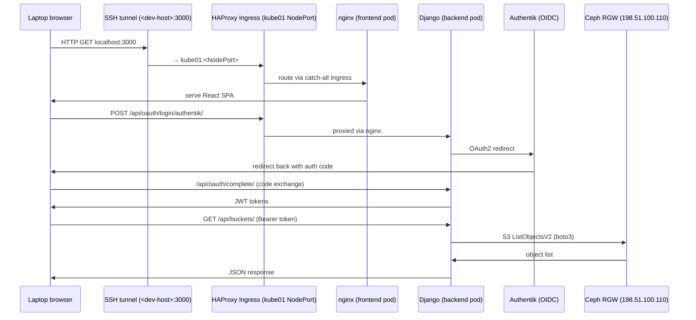

# Development Environment: Stencil Virtual Datacenter

## Why This Exists

> The addresses in this document use the TEST-NET-2 documentation block (`198.51.100.0/24`). Replace them with the addresses assigned by your own Stencil deployment.

Building and testing a web application that uses Kubernetes, Ceph RGW object storage, and an OAuth2/OIDC identity provider correctly requires running those systems for real — not with mocks. Mocks of distributed storage, Kubernetes scheduling, and OIDC redirect flows hide entire classes of production bugs.

The problem is that a real deployment requires multiple physical servers: at least three Kubernetes nodes, a Ceph storage cluster, and an identity server. That is not practical for a single developer during an internship.

**Stencil** solves this by running a complete virtual datacenter on one physical machine. Each server becomes a KVM virtual machine. The software inside — K3s, Ceph, FreeIPA — is the same software that runs in real datacenters. The VMs do not know they are virtual. From their perspective, they are real nodes talking over a real network.

This project was developed and validated entirely inside a Stencil environment before any production deployment. The exact same Kubernetes manifests, container images, and deployment scripts that ran in the virtual cluster will run in production with only environment-specific configuration changes (hostnames, S3 endpoint, credentials).

**Stencil is an open-source project by AREA Science Park.** The original repositories and documentation live at:
> https://gitlab.com/area7/datacenter/codes/stencil/docs/-/tree/main/docs

---

## Host Machine Requirements

The virtual datacenter runs ten KVM virtual machines on a single physical host. Before investing time in the setup, verify your machine meets these requirements.

| Component | Minimum | Recommended | Why |
|-----------|---------|-------------|-----|
| CPU | 8 physical cores | 16+ cores | 10 VMs share ~38 vCPUs; 8 cores works for typical dev sessions but becomes saturated when Ceph rebuilds and K3s deployments run simultaneously |
| RAM | 64 GB | 128 GB | VMs allocate 39 GB in total; the host OS, KVM hypervisor, and page cache consume the rest — below 64 GB risks OOM kills on Ceph OSD nodes |
| Disk | 300 GB SSD | 500 GB NVMe | Ceph OSD nodes use ~180 GB for storage data; root filesystems add another ~155 GB; spinning disk is not viable — HDD latency stalls the Ceph cluster |
| Network | 1 Gbit/s | 1 Gbit/s | Inter-VM traffic is virtual (bridged KVM); physical NIC speed only matters for container image pulls |

**vCPU oversubscription:** A 4–5× oversubscription ratio (38 vCPUs on 8–16 cores) is normal for a development cluster where VMs spend most of their time idle. If you plan to run CI builds, Ceph rebalancing, and active deployments at the same time, 16 cores gives meaningful headroom.

**RAM is the hard constraint.** If your machine has less than 64 GB installed, reduce the VM RAM allocations in `vars.json` before provisioning — but Ceph and K3s behavior will differ from the validated configuration.

---

## Architecture Overview

The virtual datacenter has four layers. Each layer is an independent subsystem deployed by its own provisioning project.

```
┌─────────────────────────────────────────────────────────────────────┐
│                     ONE PHYSICAL MACHINE                             │
│                                                                       │
│  ┌─────────────────────────────────────────────────────────────────┐ │
│  │  LAYER 1 — VIRTUALIZATION (tofu-libvirt)                        │ │
│  │                                                                  │ │
│  │  10 VMs on network 198.51.100.0/24 (KVM via OpenTofu)         │ │
│  │  ipa01  kube01/02/03  ceph-svc01/02/03  ceph-osd01/02/03       │ │
│  └────────────────────────────┬─────────────────────────────────────┘ │
│                               │                                       │
│  ┌────────────────────────────▼─────────────────────────────────────┐ │
│  │  LAYER 2 — DISTRIBUTED STORAGE (ceph-provisioning)              │ │
│  │                                                                  │ │
│  │  Ceph cluster: 3 svc nodes + 3 OSD nodes (9 OSDs total)        │ │
│  │  Rados Gateway (RGW): S3-compatible API at 198.51.100.110      │ │
│  └────────────────────────────┬─────────────────────────────────────┘ │
│                               │                                       │
│  ┌────────────────────────────▼─────────────────────────────────────┐ │
│  │  LAYER 3 — IDENTITY & DNS (freeipa-provisioning)                │ │
│  │                                                                  │ │
│  │  FreeIPA at 198.51.100.70: DNS, Kerberos, LDAP, CA            │ │
│  └────────────────────────────┬─────────────────────────────────────┘ │
│                               │                                       │
│  ┌────────────────────────────▼─────────────────────────────────────┐ │
│  │  LAYER 4 — KUBERNETES (kubernetes-provisioning)                 │ │
│  │                                                                  │ │
│  │  K3s 3-node HA cluster: kube01/02/03 (.10/.11/.12)             │ │
│  │  Flannel CNI │ MetalLB (.100-.105) │ nginx IngressClass         │ │
│  │                                                                  │ │
│  │  + HAProxy Ingress Controller (haproxy-4) ← added for this app │ │
│  └──────────────────────────────────────────────────────────────────┘ │
└─────────────────────────────────────────────────────────────────────┘
```

---

## IP Address Map

| Address / Range        | Node or Service                        | Role                                      |
|------------------------|----------------------------------------|-------------------------------------------|
| 198.51.100.10         | kube01                                 | K3s control plane (init node)             |
| 198.51.100.11         | kube02                                 | K3s control plane                         |
| 198.51.100.12         | kube03                                 | K3s control plane                         |
| 198.51.100.70         | ipa01                                  | FreeIPA (DNS, LDAP, Kerberos, CA)         |
| 198.51.100.80–82      | ceph-svc01/02/03                       | Ceph service nodes (MON, MGR, MDS, RGW)  |
| 198.51.100.90–92      | ceph-osd01/02/03                       | Ceph storage nodes (OSD daemons)          |
| 198.51.100.100–105    | MetalLB pool                           | External IPs for LoadBalancer services    |
| 198.51.100.105        | kube-vip                               | K3s API server HA virtual IP             |
| 198.51.100.110        | Ceph RGW virtual IP                    | S3-compatible object storage endpoint     |
| <POD_CIDR>          | Pod network                            | Internal pod IP addresses                 |
| <SERVICE_CIDR>          | Service network                        | ClusterIP service addresses               |

---

## Layer 1: Virtualization (tofu-libvirt)

OpenTofu (the open-source Terraform fork) reads a `vars.json` configuration file and tells libvirt/KVM to create 10 VMs. The VMs use Fedora as the base OS. OpenTofu provisions their CPU, memory, disk, and network — then injects an SSH key so subsequent provisioning steps can log in without interaction.

Key configuration in `vars.json`:

- `ssh_key_path` — must be an absolute path to the SSH public key
- `disk_size_per_vm` — must be set explicitly; if absent, the field defaults to the base image size (~5 GB), which will cause Ceph OSD nodes to run out of disk

Recommended minimums from this deployment:

| Node type     | Root disk | Additional disks               |
|---------------|-----------|-------------------------------|
| K3s nodes     | 15 GB     | —                             |
| Ceph svc nodes | 20 GB   | —                             |
| Ceph OSD nodes | 15 GB   | 3 × 20 GB (one per OSD)       |

---

## Layer 2: Distributed Storage (ceph-provisioning)

Ceph is a software-defined storage system that distributes data across multiple drives for redundancy and performance. This deployment uses **cephadm** (the Ceph orchestrator) via Ansible.

Components deployed:

| Component | Runs on          | Purpose                                            |
|-----------|------------------|----------------------------------------------------|
| MON       | ceph-svc01/02/03 | Tracks cluster state; required for any operation   |
| MGR       | ceph-svc01/02/03 | Dashboard, metrics, orchestration                   |
| OSD       | ceph-osd01/02/03 | Stores raw object data; 3 per node = 9 total OSDs  |
| MDS       | ceph-svc01/02/03 | Metadata for CephFS (not used by this app)         |
| RGW       | ceph-svc01/02/03 | S3-compatible HTTP API — what the application uses |

**The haproxy-based RGW ingress** provides a virtual IP (198.51.100.110) and TLS termination in front of the three RGW daemons. TLS uses a self-signed certificate; `S3_VERIFY_SSL=False` is set in the development overlay.

Data durability: each object is replicated 3× across OSDs on different nodes. Nine OSDs × ~20 GB gives ~180 GB raw / ~60 GB usable.

---

## Layer 3: Identity and DNS (freeipa-provisioning)

FreeIPA runs on ipa01 and provides:

- **DNS**: all `*.stencil.com` hostnames resolve to their correct IP addresses
- **LDAP**: user and group directory
- **Kerberos**: single sign-on authentication (not used directly by this application)
- **CA**: issues TLS certificates (used by the Kubernetes cluster for mTLS)

FreeIPA was set up using the provided Ansible playbook. It is a dependency of the Kubernetes provisioning: the K3s CoreDNS configuration forwards `stencil.com` queries to FreeIPA at 198.51.100.70.

---

## Layer 4: Kubernetes (kubernetes-provisioning)

K3s is a lightweight, CNCF-certified Kubernetes distribution. Same API as upstream Kubernetes, lower resource overhead, simpler to install.

This cluster:

- **3-node HA control plane** with embedded etcd (one leader, two followers)
- **Flannel** CNI for pod-to-pod networking (VXLAN mode)
- **MetalLB** for bare-metal LoadBalancer services
- **kube-vip** for a high-availability virtual IP on the K3s API server
- **nginx Ingress Controller** — installed by the Stencil Ansible role

The nginx ingress is the default for the Stencil provisioning. The application adds a second ingress controller (see below).

---

## Additions for This Project

### HAProxy Ingress Controller

**Why it was added:** The production cluster at AREA Science Park uses a HAProxy-based ingress controller with the IngressClass name `haproxy-4`. To validate ingress routing in development with an identical configuration, the same controller and class name were installed in the Stencil cluster.

The development cluster therefore runs two ingress controllers side by side:

```
IngressClass: nginx         ← Stencil default (not used by this app)
IngressClass: haproxy-4     ← Added to match production
```

The application manifests use `ingressClassName: haproxy-4` both in development and production. The two ingress resources are:

| File                        | IngressClass | Host filter                            | Environment |
|-----------------------------|--------------|----------------------------------------|-------------|
| `04-ingress.dev.yaml`       | haproxy-4    | None (catch-all)                       | Dev only    |
| `04-ingress.yaml`           | haproxy-4    | `<production-hostname>`  | Production  |

The catch-all dev ingress accepts any hostname, so `localhost:3000` (tunnelled to the HAProxy NodePort) passes through the full `HAProxy → nginx → backend` chain during development.

### Container Registry (GHCR)

Container images are published to the **GitHub Container Registry** (`ghcr.io/luisfpal/...`) as public packages. K3s nodes pull images without authentication because the packages are public. The developer pushes images using a classic GitHub PAT with `write:packages` scope, stored in `k8s/.env` (gitignored).

This replaced the local Stencil registry (`registry.stencil.com:5000`) used in the original Stencil setup. GHCR was chosen because images are accessible from any environment — production K3s nodes can pull the same image as development nodes without configuring a registry mirror.

### GitHub Actions (verify only)

The repository workflow [`.github/workflows/ci.yml`](../.github/workflows/ci.yml) runs **verify** on every push/PR to `main`: pytest, frontend build, and optional Codecov upload. It does **not** deploy.

Dev deploy is manual on the operator host — see [Development deployment operations](dev-deployment-operations.md).

### GitHub Actions Runners (ARC, optional)

**ARC** (Actions Runner Controller) can install a self-hosted runner inside K3s via `k8s/ci.sh` (requires `GITHUB_PAT` with `repo` scope). Optional; not required for green CI or day-to-day dev when you deploy with `app.sh`.


---

## How the Application Uses This Environment

The complete request path from a developer's browser to Ceph object storage:



---

## Relationship to Production

The production cluster at AREA Science Park differs in only these respects:

| Aspect                | Development (Stencil)                     | Production (AREA SP)                         |
|-----------------------|-------------------------------------------|----------------------------------------------|
| Infrastructure        | KVM VMs on one physical host              | Physical servers in the ORFEO datacenter     |
| Kubernetes            | K3s (Stencil cluster)                     | K3s or full K8s (production cluster)         |
| Ingress               | haproxy-4 (self-installed)               | haproxy-4 (platform-managed)                 |
| S3 endpoint           | 198.51.100.110 (self-signed TLS)        | Production Ceph RGW (trusted TLS)            |
| Registry              | GHCR public packages                      | GHCR public packages (same)                  |
| Identity              | Authentik in-cluster                      | Authentik (platform-managed)                 |
| TLS                   | Self-signed, `S3_VERIFY_SSL=False`        | Trusted CA, `S3_VERIFY_SSL=True`             |
| Config                | `k8s/env/dev/*.local.yaml`               | `k8s/env/prod/*.local.yaml` + secret manager |

Kubernetes manifests in `k8s/manifests/` require no changes between environments. Only the environment overlay values change.
