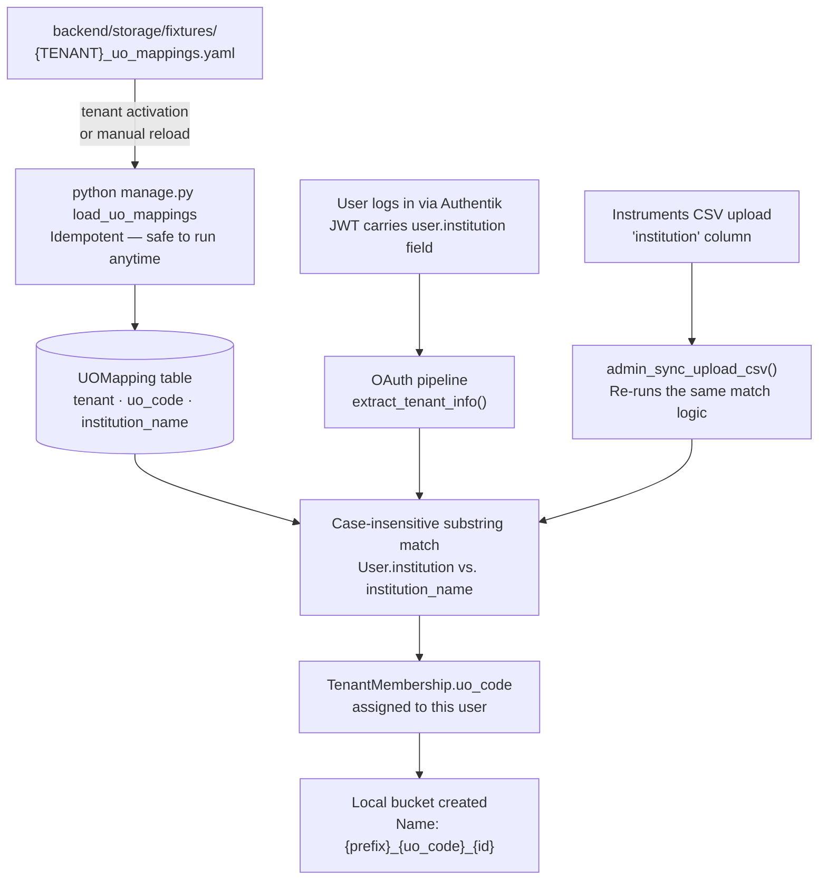

# Tenants with UO Codes

## The problem UO codes solve

A large research facility handles data from many different institutions. Scientists from CNR Trieste, POLIMI Milan, and a dozen other universities all share the same storage platform — but storage ownership matters. When a bucket or file needs to be attributed to an institution (for billing, data management, or audit), the answer should be readable directly from the name, without opening a database.

**UO codes** (Unità Operativa, Italian for "Operational Unit") solve this. Each participating institution gets a short, stable identifier that appears directly in local bucket names. A bucket created by a user from CNR - IOM Trieste becomes `nffa-di_cnr-iom.ts_17` — unambiguous in any S3 listing, billing report, or backup manifest, long after the person who created it has left.

Not every tenant needs this. A simple tenant with one read-write group and one read-only group works fine without UO codes. But any tenant where users from different institutions share a common storage area and create their own research buckets benefits from the provenance that UO codes provide.

---

## How it works: the data flow



The system has two entry points for assigning a UO code to a user:

1. **Login**: the OAuth pipeline reads the `institution` field from the Authentik JWT claim and does a case-insensitive substring search against `UOMapping.institution_name`. On a match, the code is written to `TenantMembership.uo_code` for that user's membership in this tenant.

2. **CSV upload**: the instruments CSV uploaded through the Sync admin page also carries institution data. The backend re-runs the same matching logic and updates `TenantMembership.uo_code` for all matched users in the NFFADI structure.

Both paths converge on `TenantMembership.uo_code`. Once set, that code flows into local bucket naming automatically.

---

## The fixture format

UO codes are static configuration — they change only when institutions join or leave the facility. They live in YAML files inside the Django application:

```
backend/storage/fixtures/{TENANT_CODE}_uo_mappings.yaml
```

Here is the real NFFADI fixture, which covers the CNR network, AREA, POLIMI, and UNIMI:

```yaml
# backend/storage/fixtures/nffadi_uo_mappings.yaml

tenant: NFFADI        # must match Tenant.code exactly — case-sensitive

uo_mappings:
  - institution_name: "CNR - Istituto Officina dei Materiali - Trieste"
    uo_code: "cnr-iom.ts"

  - institution_name: "CNR - Istituto di Microelettronica e Microsistemi - Catania"
    uo_code: "cnr-imm.ct"

  - institution_name: "CNR - Istituto di Fotonica e Nanotecnologie - Trento"
    uo_code: "cnr-ifn.tn"

  - institution_name: "POLIMI - POLIFAB (Milano)"
    uo_code: "polifab"

  - institution_name: "UNIMI - Dipartimento di Fisica \"Aldo Pontremoli\" (Milano)"
    uo_code: "unimi"

  # ... one entry per institution
```

### Field rules

| Field | Rule |
|---|---|
| `tenant` | Must match `Tenant.code` in the database exactly. Case-sensitive. |
| `institution_name` | Matched against `User.institution` (from the Authentik JWT) using **case-insensitive substring** search. Must be precise enough to avoid false positives across institutions with similar names. |
| `uo_code` | Appears directly in bucket names. Use lowercase letters, digits, and hyphens only. Keep it short (≤ 20 characters). Changing it after buckets exist renames nothing in S3. |

The substring matching is intentional: institution names in JWTs sometimes have minor variations in capitalization or spacing. A pattern like `"CNR - Istituto Officina dei Materiali - Trieste"` matches any institution field that contains that string, case-insensitively.

---

## Adding UO codes for a new tenant

### Step 1 — Create the fixture file

Create `backend/storage/fixtures/{TENANT_CODE}_uo_mappings.yaml`. Name the file with the tenant's `code` field, lowercased. A tenant with code `PHOTON` gets `photon_uo_mappings.yaml`.

```yaml
tenant: PHOTON
uo_mappings:
  - institution_name: "Istituto Nazionale di Ottica - Firenze"
    uo_code: "ino-fi"
  - institution_name: "LENS - European Laboratory for Non-linear Spectroscopy"
    uo_code: "lens"
```

Commit this file to the repository. It is safe to commit — it contains no credentials, only institution names and codes that are already visible in bucket names.

### Step 2 — Activate the tenant

Activate the tenant from the admin panel (**Tenants → "Activate tenant"**). The backend view that handles activation calls `load_uo_mappings` automatically as part of the process. If the fixture file exists at that moment, the mappings are loaded immediately.

Verify: navigate to the **UO Mappings** section in the admin panel, filter by tenant, and confirm your entries appear.

### Step 3 — Reload after edits

If you edit the fixture after the tenant is already active, reload without re-activating:

```bash
kubectl exec -n bucket-explorer deployment/backend -- \
  python manage.py load_uo_mappings --tenant PHOTON
```

The command is idempotent — it uses `update_or_create` on `(tenant, uo_code)`. Running it multiple times is safe and produces no side effects.

### Step 4 — Verify assignment

After a user from a mapped institution logs in, check the **Users** page in the admin panel. Their row should show a non-empty UO code. If the code is blank:

- The institution string from their JWT did not match any `institution_name` substring
- Check the exact value of their `institution` field: admin panel → Users → expand user row
- Adjust the `institution_name` in the fixture to match and reload

---

## Updating existing mappings

To rename an `institution_name` for an existing `uo_code`:

1. Edit the fixture file
2. Reload: `python manage.py load_uo_mappings --tenant {CODE}`

The `update_or_create` call updates the DB record. Existing `TenantMembership` records already holding the old assignment are **not** retroactively changed — users pick up the new match on their next login when the pipeline re-runs.

To rename a `uo_code` itself: this requires deleting the old `UOMapping` record manually (Django admin or DB) and re-running the command with the new code. Bucket names already using the old code are permanent S3 keys in Ceph and cannot be renamed by the webapp.

---

## Tenants without UO codes

If a tenant's users all belong to one institution, or if provenance in bucket names is not required, do not create a fixture file. The system handles the absence cleanly:

- `load_uo_mappings` finds no matching fixture and skips silently
- `TenantMembership.uo_code` remains empty for all users
- Bucket naming falls back to a simpler scheme without the UO component

The UO code feature activates only for tenants that have a fixture file with entries for at least one active institution.
